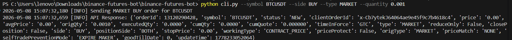
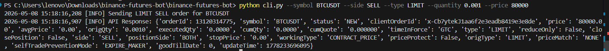
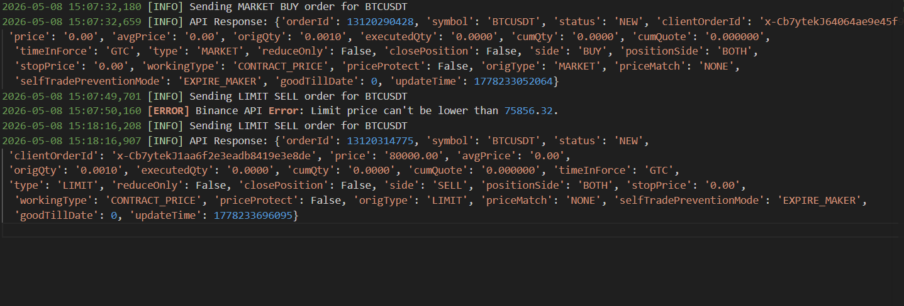
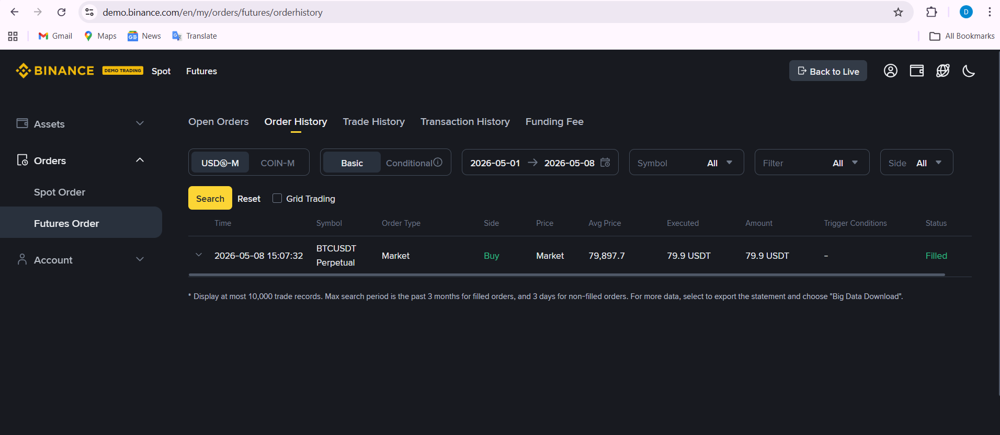
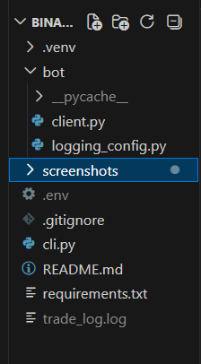

# Binance Futures Trading Bot

A simple Binance Futures Testnet trading bot built using Python.

## Features
- Market Orders
- Limit Orders
- Logging System
- CLI-Based Execution
- Binance Futures Testnet Support

## Installation

```bash
pip install -r requirements.txt
```

## Run Market Order

```bash
python cli.py --symbol BTCUSDT --side BUY --type MARKET --quantity 0.001
```

## Run Limit Order

```bash
python cli.py --symbol BTCUSDT --side SELL --type LIMIT --quantity 0.001 --price 60000
```
# Screenshots

## Market Order



## Limit Order



## Logs



## Futures Orders



## Project Structure



## Tech Stack
- Python
- python-binance
- dotenv